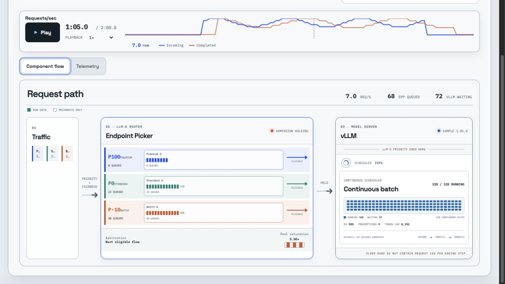
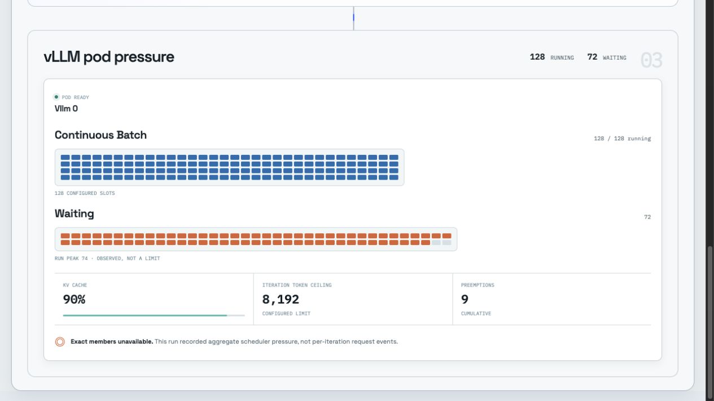

# Flow Control Flight Recorder

Replay llm-d flow-control experiments as a synchronized system diagram and telemetry view.

The UI connects client pressure, Endpoint Picker (EPP) admission queues, and vLLM continuous
batching at the same recorded moment. It shows measured data without inventing request routes or
batch membership.



## What It Shows

- **Traffic:** request rate and in-flight concurrency for each configured tenant.
- **Endpoint Picker:** priority bands, fairness queues, queue depth, bytes, saturation, and admission state.
- **vLLM:** running and waiting requests, configured sequence slots, KV-cache pressure, token ceiling, and preemptions.
- **Time:** one playhead keeps the graph, component diagram, and telemetry on the same sample.



## Evidence Rules

The replay distinguishes recorded state from explanatory mechanics.

| Display | Source | Meaning |
| --- | --- | --- |
| Solid values and filled cells | Saved run metrics | Exact at the recorded sampling interval |
| Dashed elements and scheduler motion | UI explanation | System mechanics, not measured request movement |
| `Need metrics` or `Need config` | Missing artifact | The UI refuses to guess |

The continuous-batch grid contains one cell per configured `max_num_seqs` slot. The waiting grid
contains one cell per request at the observed run peak. vLLM does not expose a configured
waiting-queue capacity, so the UI labels that peak as an observation, not a limit.

## Quick Start

```bash
npm install
npm run dev
```

Open the local URL and use the built-in synthetic replay. No experiment data is required.

## Replay One Run

A run directory must contain:

- `client_samples.csv`
- `metric_samples.csv`

It may also contain `concurrency_samples.csv`, `summary.json`, and `benchmark_config.json`.

```bash
npm run ingest -- --run-dir /absolute/path/to/run
npm run dev
```

The command writes `public/data/run.json`. Git ignores generated replay data.

Choose another output path when you do not want to load the artifact in the UI:

```bash
npm run ingest -- \
  --run-dir /absolute/path/to/run \
  --output /tmp/run.json
```

## Browse a Run Library

Add one or more artifact roots to an ignored `.env.local` file. Separate roots with `:` on macOS
and Linux or `;` on Windows.

```bash
FLOW_RUN_ROOTS=/absolute/path/to/campaign-a:/absolute/path/to/campaign-b
```

Restart the development server. The selector groups every directory that contains
`client_samples.csv` and labels its replay coverage:

- **Full replay:** client concurrency, EPP queues, and vLLM pressure.
- **Queues + runtime:** EPP and vLLM data without client concurrency samples.
- **Client/partial:** client timing plus any compatible older metrics.

The API exposes opaque run IDs. It never returns configured filesystem paths.

## Configure a Run

Tenant IDs, priorities, and objectives come from captured client data. Runtime limits and band
display metadata come from `benchmark_config.json`:

```json
{
  "vllm_runtime": {
    "max_num_seqs": 128,
    "max_num_batched_tokens": 8192,
    "scheduler_policy": "fcfs"
  },
  "epp_runtime": {
    "priority_bands": [
      { "priority": 100, "label": "Premium", "color": "#2d5bff" },
      { "priority": 0, "label": "Standard", "color": "#168f82" },
      { "priority": -10, "label": "Batch", "color": "#d95b30" }
    ]
  }
}
```

The UI supports any number of tenants, bands, and vLLM metric sources. Card layouts follow a
no-orphan rule: the last row expands symmetrically and never leaves a blank, ghost-like cell.

## Deterministic Playback

Open the same evidence window with query parameters:

```text
?run=<catalog-id>&time=75&speed=1&autoplay=1
```

Supported speeds are `0.5`, `1`, `2`, and `4`. Add `record=1` to lock the wide presentation layout
and disable decorative component motion for screen capture.

## Data Boundary

Current artifacts support exact post-run playback at their sampling interval. A smoother display
cannot recover events that were never recorded.

Exact request waterfalls and exact vLLM iteration membership require:

- a request or trace ID shared by client, router, and model server;
- timestamped EPP enqueue, dequeue, and dispatch events;
- router endpoint-selection events;
- opt-in vLLM scheduler iteration events.

Until those signals exist, the UI presents aggregate scheduler pressure and states the limitation.

## Quality and Safety

- TypeScript uses strict mode.
- Run artifacts pass structural validation before rendering.
- Visual slot counts are bounded to prevent malformed data from freezing the browser.
- Configuration colors accept six-digit hex values only.
- Keyboard focus stays inside the help dialog; reduced-motion preferences disable animation.
- The repository contains a synthetic demo and screenshots only—no private run artifacts.

```bash
npm test       # Unit tests
npm run build  # Type-check and production build
npm audit      # Dependency vulnerability audit
```

## License

[Apache License 2.0](LICENSE)
