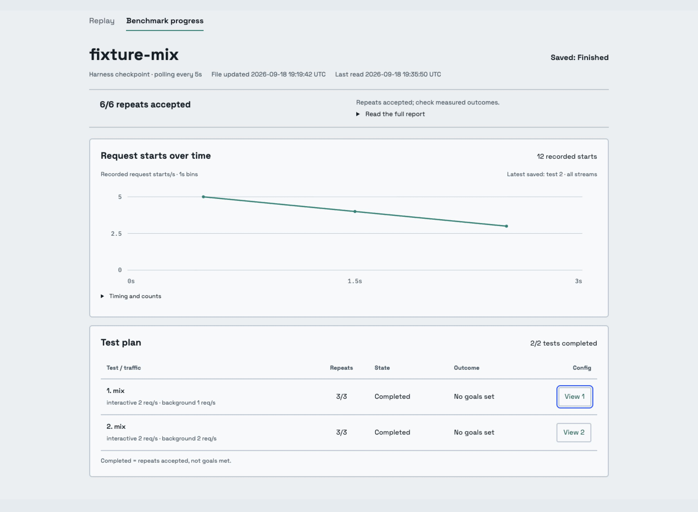
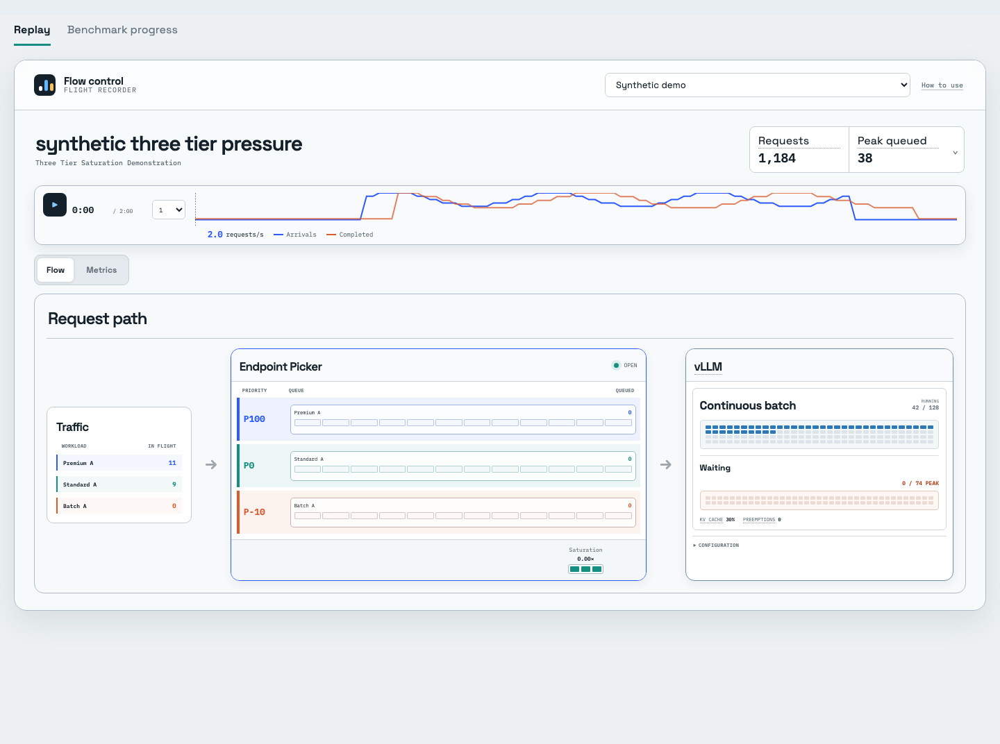

# Flow Control Flight Recorder

Replay recorded llm-d experiments or follow saved benchmark progress. Both views
are read-only; this app does not run benchmarks or change serving configuration.

| View | Input | What it shows |
|---|---|---|
| Replay | Synthetic demo or compatible CSV replay artifacts | Client pressure, Endpoint Picker queues and vLLM telemetry at a recorded time |
| Benchmark progress | Native AIPerf exports, optionally inside [harness](https://github.com/rh-aiservices-bu/inference-benchmark-harness) output | Recorded traffic over time; harness state adds the full test plan, repeat progress and outcomes |

These are different formats. Native AIPerf JSON/JSONL supports **progress**;
it is not accepted by the legacy CSV replay ingester.



Progress shown above uses a local AIPerf loopback fixture, not GPU performance data.



Replay shown above is synthetic; load recorded artifacts for measured values.

## Start locally

Use **Node.js 22.12+** and npm on macOS or Linux. No GPU, cluster credentials or
Prometheus database is needed to view saved data.

```sh
git clone https://github.com/alexagriffith/flow-control-visualizer.git
cd flow-control-visualizer
npm ci
npm run dev
```

Open the printed localhost URL. Replay starts with the labeled synthetic demo;
progress stays empty until configured. Keep the server local.

## Follow a benchmark

Set a **native AIPerf export directory** (containing `profile_export.jsonl`) or a
**harness output directory** (containing `config.json` and `state.json`):

```sh
FLOW_PROGRESS_RUN=/absolute/path/to/results npm run dev
```

Select **Benchmark progress**. It polls saved files every five seconds. Disconnection
retains the last readable snapshot with an error; stale checkpoints are labeled.
This is not a runner heartbeat or live-ingress monitor. Missing traffic is not zero.

Native exports work without a harness or matrix. They do not describe pending tests,
repeat progress or a currently running process; the viewer does not invent these.
Summary-only exports show no timeline. Default export filenames are required.

The line chart shows recorded starts per second in fixed time bins, including failed
requests with timestamps. With harness output it uses the latest attempt, all streams.
Config details expose a safe field
projection and the source file's hash/time—not headers, prompts or paths.
Accepted repeats and performance outcomes are separate. There are no execution controls.
If a goal miss or request error stops a run, later tests remain pending.
The suggested report command is not a claim about a currently executing command.

[Progress setup, interpretation and read limits](docs/progress.md).
[Harness example: inputs, four planned tests, commands and outputs](docs/harness-workflow.md).

## Replay a CSV run

Required: `client_samples.csv` and `metric_samples.csv`. Optional:
`concurrency_samples.csv`, `traffic_samples.csv`, `summary.json`, `benchmark_config.json`.
Use the schemas produced by the compatible benchmark packages below; arbitrary CSV
columns or native AIPerf exports are not interchangeable with these files.
Neither AIPerf's summary CSV nor arbitrary GuideLLM exports match this adapter.
Native AIPerf server metrics are not yet mapped into the animated routing replay.

```sh
npm run ingest -- --run-dir /absolute/path/to/run
npm run dev
```

This writes ignored `public/data/run.json`, loaded by replay on startup.
Use `--output /absolute/path/run.json` to write elsewhere without replacing the UI's
loaded run. Ingestion reads trusted local artifacts; review them before loading.
Files in `public/` are served by Vite and included by the production build.

Optional request fields include `request_id`, `planned_arrival_s`, `prompt_tokens`,
`completion_tokens` and `tpot_s`. `traffic_samples.csv` preserves offered-load and
arrival-process evidence; it is not inferred from completion throughput.

### Published packages

```sh
npm run ingest:package -- \
  --package-dir /absolute/path/to/benchmark-package \
  --run-name "exact run name from summary.csv"
npm run dev
```

Supports upstream packages with `request-results.csv`, `traffic-samples.csv` and
`system-metrics.csv`, plus the two-model batch-eviction package. Summary-only packages
cannot be replayed. [Available packages](https://github.com/alexagriffith/flow-control-benchmarks/tree/main/benchmark-data).

### Run library

Put this in ignored `.env.local`, then restart the dev server:

```text
FLOW_RUN_ROOTS=/absolute/path/to/campaign-a:/absolute/path/to/campaign-b
```

The selector discovers compatible CSV runs. API IDs are opaque; labels and loaded
replay data remain visible to anyone with access to the local server.
Use trusted roots and do not expose the server to an untrusted network.

## Read the replay correctly

- Solid values show saved samples; dashed elements and motion explain mechanics.
- The default demo is synthetic, not a measured experiment.
- Missing artifacts show `Need metrics` / `Need config`; motion cannot recover missing events.
- Continuous-batch cells represent configured `max_num_seqs` slots. Waiting cells
  show the observed peak, **not** an engine queue limit.
- Exact routing and per-iteration batch membership require correlated traces that
  these aggregate artifacts do not provide.

Runtime limits and band display metadata may be supplied in `benchmark_config.json`:

```json
{
  "vllm_runtime": {"max_num_seqs": 128, "max_num_batched_tokens": 8192, "scheduler_policy": "fcfs"},
  "epp_runtime": {"priority_bands": [{"priority": 100, "label": "Interactive", "color": "#2d5bff"}]}
}
```

These describe the captured run; they do not configure llm-d or vLLM.

## Record a replay

Install Chromium with `npx playwright install chromium` and provide `ffmpeg` on PATH.
Start the dev server with the intended replay loaded, then:

```sh
npm run record -- --url http://127.0.0.1:5173/ \
  --start-time 90 --poster-time 120 --speed 2 --seconds 30 \
  --output /absolute/path/replay.mp4
```

Outputs an 880×626 MP4 and PNG poster. Reproducible browser playback supports
`?run=<catalog-id>&time=75&speed=1&autoplay=1`. Speeds: `0.5`, `1`, `2`, `4`.
`record=1` fixes the wide replay layout and disables decorative motion.

## Verify and build

```sh
npm test
npm run build
npm audit
```

The production build supports static replay. **Progress and run-library APIs require
`npm run dev`; they are unavailable with `npm run preview` or static hosting.**
Before distributing `dist/`, remove private data from your build inputs: ignored
files under `public/data/` are still copied into it. Never publish private artifacts.

Tests cover parsing, bounded grids, progress state, sanitization, partial exports and
unsafe files. Keyboard controls and reduced motion are supported. Screenshots and
local fixture tests establish UI behavior, not model performance.

[Apache License 2.0](LICENSE)
